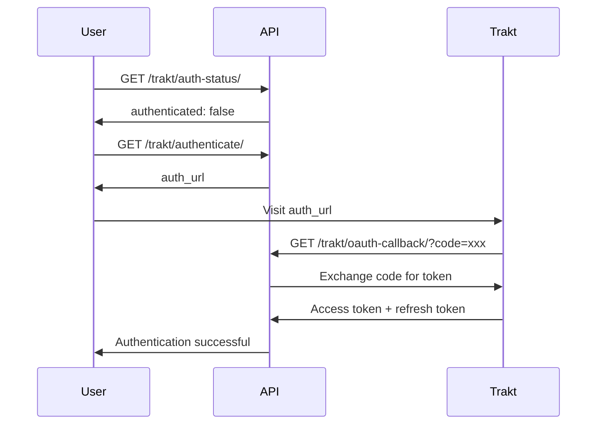

# Trakt Service Integration

This document provides comprehensive documentation for the **Trakt** service endpoints, covering movie and TV show tracking with OAuth2 authentication.

## Overview

The Trakt service allows you to:

- **OAuth Authentication**: Secure token-based authentication with automatic refresh
- **Movie Tracking**: Fetch and store watched movies with metadata
- **TV Show Tracking**: Track watched episodes and seasons with detailed information
- **TMDB Integration**: Enhanced metadata from The Movie Database
- **Pagination Support**: Efficient data retrieval for large collections

---

## Setup & Authentication

### 1. Get Trakt API Credentials

1. **Create Trakt Application**:
   - Visit [Trakt API Applications](https://trakt.tv/oauth/applications)
   - Create a new application
   - Note your `Client ID` and `Client Secret`
   - Set redirect URI (e.g., `http://localhost:8000/trakt/oauth-callback/`)

2. **Store Trakt Credentials**:

   ```bash
   curl -X POST "http://localhost:8000/users/api-keys/" \
        -H "Authorization: Bearer YOUR_JWT_TOKEN" \
        -H "Content-Type: application/json" \
        -d '{
          "service_name": "trakt_client_id",
          "api_key": "YOUR_TRAKT_CLIENT_ID"
        }'

   curl -X POST "http://localhost:8000/users/api-keys/" \
        -H "Authorization: Bearer YOUR_JWT_TOKEN" \
        -H "Content-Type: application/json" \
        -d '{
          "service_name": "trakt_client_secret",
          "api_key": "YOUR_TRAKT_CLIENT_SECRET"
        }'
   ```

### 2. OAuth2 Authentication Flow

The Trakt service uses OAuth2 for secure authentication:

1. **Check Authentication Status**
2. **Initiate OAuth Flow**
3. **Handle OAuth Callback**
4. **Automatic Token Refresh**

---

## API Endpoints

### Authentication Endpoints

#### 1. Check Authentication Status

**Endpoint**: `GET /trakt/auth-status/`

**Description**: Check if user has a valid Trakt token.

**Authentication**: Required (JWT Token)

**Example Request**:

```bash
curl -H "Authorization: Bearer YOUR_JWT_TOKEN" \
     "http://localhost:8000/trakt/auth-status/"
```

**Response** (Authenticated):

```json
{
    "authenticated": true,
    "token_expired": false,
    "expires_at": "2024-02-15T14:30:00Z"
}
```

**Response** (Not Authenticated):

```json
{
    "authenticated": false,
    "auth_url": "http://localhost:8000/trakt/authenticate/"
}
```

#### 2. Initiate Authentication

**Endpoint**: `GET /trakt/authenticate/`

**Description**: Get Trakt OAuth authorization URL.

**Authentication**: Required (JWT Token)

**Example Request**:

```bash
curl -H "Authorization: Bearer YOUR_JWT_TOKEN" \
     "http://localhost:8000/trakt/authenticate/"
```

**Response**:

```json
{
    "auth_url": "https://api.trakt.tv/oauth/authorize?response_type=code&client_id=YOUR_CLIENT_ID&redirect_uri=YOUR_REDIRECT_URI&state=USER_ID",
    "message": "Visit this URL to authorize your Trakt account"
}
```

#### 3. OAuth Callback Handler

**Endpoint**: `GET|POST /trakt/oauth-callback/`

**Description**: Handle OAuth callback from Trakt.

- **GET**: Receives redirect from Trakt (no auth required)
- **POST**: Processes authorization code (requires auth)

**Example GET Response** (from Trakt redirect):

```json
{
    "message": "Authorization successful! You can now use Trakt endpoints.",
    "status": "success"
}
```

#### 4. Refresh Token

**Endpoint**: `GET /trakt/refresh-token/`

**Description**: Manually refresh the Trakt access token.

**Authentication**: Required (JWT Token)

**Example Request**:

```bash
curl -H "Authorization: Bearer YOUR_JWT_TOKEN" \
     "http://localhost:8000/trakt/refresh-token/"
```

**Response**:

```json
{
    "access_token": "new_access_token_here",
    "expires_at": "2024-02-15T14:30:00Z"
}
```

---

### Movie Endpoints

#### 1. Fetch Latest Movies

**Endpoint**: `GET /trakt/fetch-latest-movies/`

**Description**: Fetches latest watched movies from Trakt and updates database.

**Authentication**: Required (JWT Token + Trakt Token)

**Example Request**:

```bash
curl -H "Authorization: Bearer YOUR_JWT_TOKEN" \
     "http://localhost:8000/trakt/fetch-latest-movies/"
```

**Response**:

```json
{
    "result": "Movies fetched and stored successfully"
}
```

#### 2. Get Stored Movies

**Endpoint**: `GET /trakt/get-stored-movies/`

**Description**: Retrieves stored movies with pagination support.

**Authentication**: Required (JWT Token)

**Query Parameters**:

- `page` (optional): Page number (default: 1)
- `page_size` (optional): Items per page (default: 5)

**Example Request**:

```bash
curl -H "Authorization: Bearer YOUR_JWT_TOKEN" \
     "http://localhost:8000/trakt/get-stored-movies/?page=1&page_size=10"
```

**Response**:

```json
{
    "page": 1,
    "page_size": 10,
    "total_items": 50,
    "total_pages": 5,
    "movies": [
        {
            "plays": 1,
            "last_watched_at": "2024-01-15T20:30:00Z",
            "last_updated_at": "2024-01-15T20:35:00Z",
            "movie": {
                "title": "The Matrix",
                "year": 1999,
                "ids": {
                    "trakt": 12345,
                    "slug": "the-matrix-1999",
                    "imdb": "tt0133093",
                    "tmdb": 603
                }
            }
        }
    ]
}
```

---

### TV Show Endpoints

#### 1. Fetch Latest Shows

**Endpoint**: `GET /trakt/fetch-latest-shows/`

**Description**: Fetches latest watched TV shows and episodes from Trakt.

**Authentication**: Required (JWT Token + Trakt Token)

**Example Request**:

```bash
curl -H "Authorization: Bearer YOUR_JWT_TOKEN" \
     "http://localhost:8000/trakt/fetch-latest-shows/"
```

**Response**:

```json
{
    "result": "Shows and episodes fetched and stored successfully"
}
```

#### 2. Get Stored Shows

**Endpoint**: `GET /trakt/get-stored-shows/`

**Description**: Retrieves stored TV shows with pagination.

**Authentication**: Required (JWT Token)

**Query Parameters**:

- `page` (optional): Page number (default: 1)
- `page_size` (optional): Items per page (default: 5)

**Example Request**:

```bash
curl -H "Authorization: Bearer YOUR_JWT_TOKEN" \
     "http://localhost:8000/trakt/get-stored-shows/?page=1&page_size=5"
```

**Response**:

```json
{
    "page": 1,
    "page_size": 5,
    "total_items": 25,
    "total_pages": 5,
    "shows": [
        {
            "last_watched_at": "2024-01-15T21:00:00Z",
            "show": {
                "id": 123,
                "title": "Breaking Bad",
                "year": 2008,
                "image_url": "https://image.tmdb.org/t/p/w500/...",
                "ids": {
                    "trakt": 54321,
                    "tmdb": 1396
                }
            }
        }
    ]
}
```

#### 3. Get Watched Seasons & Episodes

**Endpoint**: `GET /trakt/get-watched-seasons-episodes/`

**Description**: Get detailed seasons and episodes for a specific show.

**Authentication**: Required (JWT Token)

**Query Parameters**:

- `trakt_id` (required): Trakt ID of the show

**Example Request**:

```bash
curl -H "Authorization: Bearer YOUR_JWT_TOKEN" \
     "http://localhost:8000/trakt/get-watched-seasons-episodes/?trakt_id=54321"
```

**Response**:

```json
{
    "seasons": [
        {
            "id": 1,
            "season_number": 1,
            "show__id": 123,
            "show__title": "Breaking Bad",
            "show__trakt_id": 54321
        }
    ],
    "episodes": [
        {
            "id": 1,
            "episode_number": 1,
            "title": "Pilot",
            "image_url": "https://image.tmdb.org/t/p/w500/...",
            "rating": 8.5,
            "overview": "Episode description...",
            "season__id": 1,
            "season__season_number": 1,
            "show__id": 123,
            "show__title": "Breaking Bad",
            "show__trakt_id": 54321,
            "last_watched_at": "2024-01-15T21:00:00Z",
            "progress": 100
        }
    ]
}
```

---

## Data Models

### Movie Model

```python
class Movie(models.Model):
    user = models.ForeignKey(User, on_delete=models.CASCADE)
    trakt_id = models.IntegerField()
    title = models.CharField(max_length=255)
    year = models.IntegerField()
    slug = models.CharField(max_length=255)
    imdb_id = models.CharField(max_length=20, null=True, blank=True)
    tmdb_id = models.IntegerField(null=True, blank=True)
    plays = models.IntegerField(default=0)
    last_watched_at = models.DateTimeField()
    last_updated_at = models.DateTimeField(auto_now=True)
```

### Show Model

```python
class Show(models.Model):
    user = models.ForeignKey(User, on_delete=models.CASCADE)
    trakt_id = models.IntegerField()
    tmdb_id = models.IntegerField(null=True, blank=True)
    title = models.CharField(max_length=255)
    year = models.IntegerField()
    image_url = models.URLField(null=True, blank=True)
    last_watched_at = models.DateTimeField()
```

### Season Model

```python
class Season(models.Model):
    show = models.ForeignKey(Show, on_delete=models.CASCADE, related_name='seasons')
    season_number = models.IntegerField()
```

### Episode Model

```python
class Episode(models.Model):
    show = models.ForeignKey(Show, on_delete=models.CASCADE, related_name='episodes')
    season = models.ForeignKey(Season, on_delete=models.CASCADE, related_name='episodes')
    episode_number = models.IntegerField()
    title = models.CharField(max_length=255)
    image_url = models.URLField(null=True, blank=True)
    rating = models.FloatField(null=True, blank=True)
    overview = models.TextField(null=True, blank=True)
```

---

## Advanced Features

### Automatic Token Refresh

The system automatically refreshes expired tokens:

- Checks token expiration before API calls
- Refreshes tokens seamlessly in background
- Handles refresh token expiration gracefully

### TMDB Integration

Enhanced metadata from The Movie Database:

- **Movie Posters**: High-quality artwork
- **Show Images**: Backdrop and poster images
- **Detailed Information**: Ratings, overviews, genres
- **Cross-Platform IDs**: Links to IMDB, TMDB, Trakt

### Pagination Support

Efficient data handling for large collections:

- **Configurable Page Size**: Adjust items per page
- **Total Count**: Know total items available
- **Page Navigation**: Easy pagination implementation

---

## Error Handling

### Common Errors

| Error | Cause | Solution |
|-------|-------|----------|
| `No Trakt token found` | User not authenticated | Visit `/trakt/authenticate/` |
| `Trakt token expired` | Token needs refresh | Automatic refresh or manual via `/trakt/refresh-token/` |
| `No Trakt client credentials` | Missing API keys | Add client ID and secret in profile |
| `Invalid authorization code` | OAuth flow issue | Restart authentication process |
| `The 'trakt_id' parameter is required` | Missing query parameter | Add required `trakt_id` parameter |

### Rate Limits

- **Trakt API**: 1000 requests per hour per user
- **TMDB API**: 40 requests per 10 seconds

### Authentication Flow



---

## Integration Notes

### OAuth2 Flow

- Uses standard OAuth2 authorization code flow
- Stores encrypted tokens in database
- Automatic token refresh before expiration
- Secure state parameter for CSRF protection

### Data Synchronization

- **Incremental Updates**: Only fetches new/updated data
- **Duplicate Prevention**: Prevents duplicate entries
- **Metadata Enhancement**: TMDB provides additional details
- **Progress Tracking**: Stores episode watch progress

### Security Features

- **Encrypted Token Storage**: All tokens encrypted at rest
- **User Isolation**: Data isolated per authenticated user
- **CSRF Protection**: State parameter validates OAuth requests
- **Token Expiration**: Automatic handling of expired tokens

This comprehensive Trakt integration provides powerful movie and TV show tracking with secure authentication and rich metadata!
