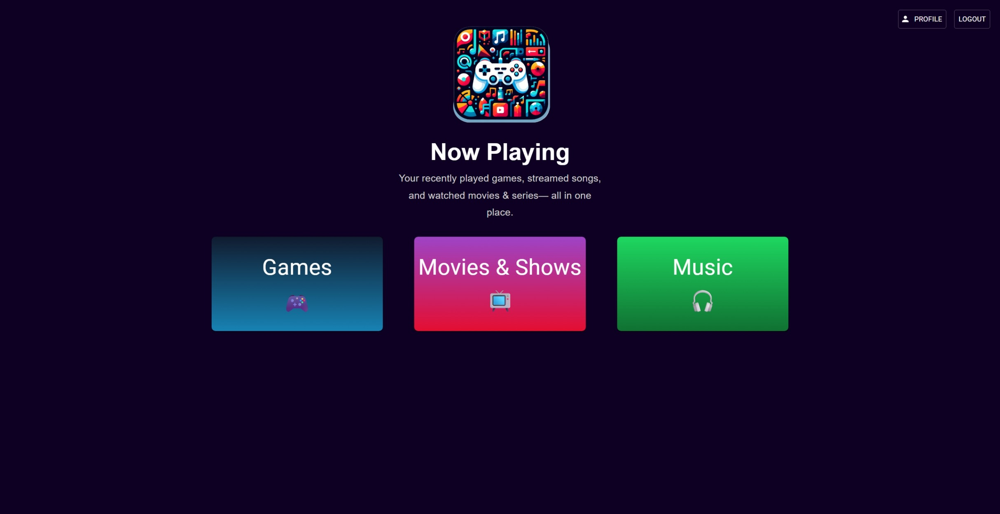
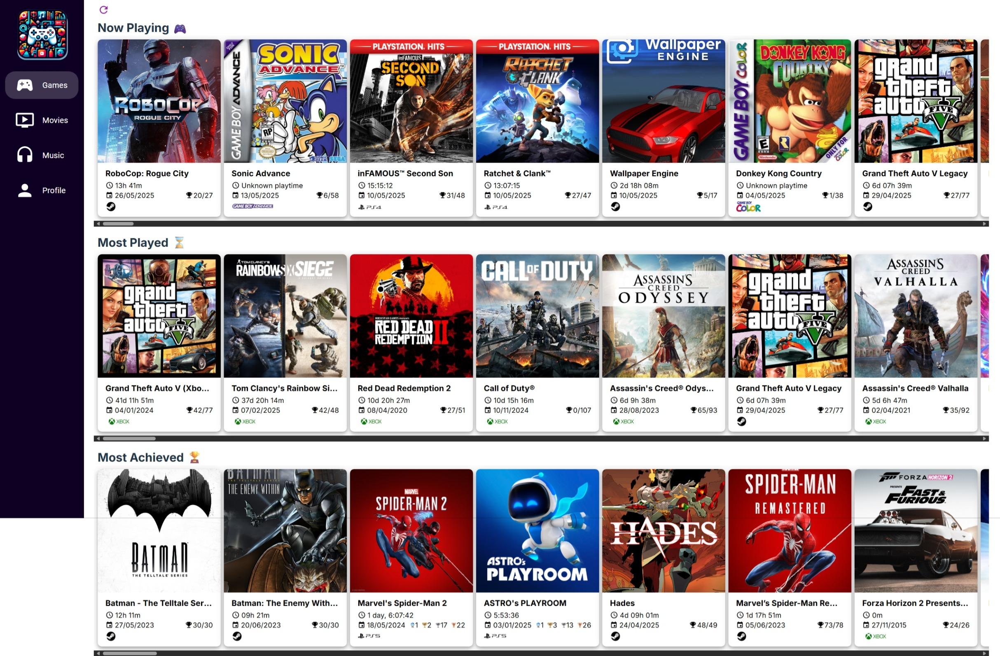
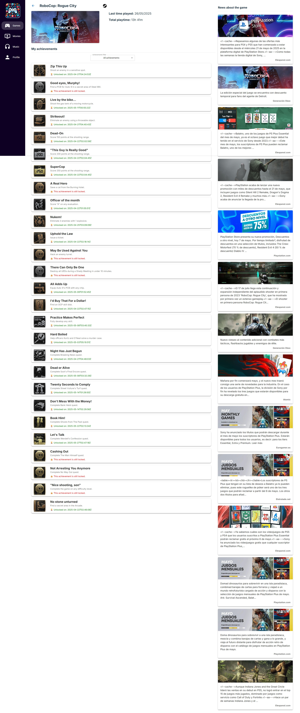
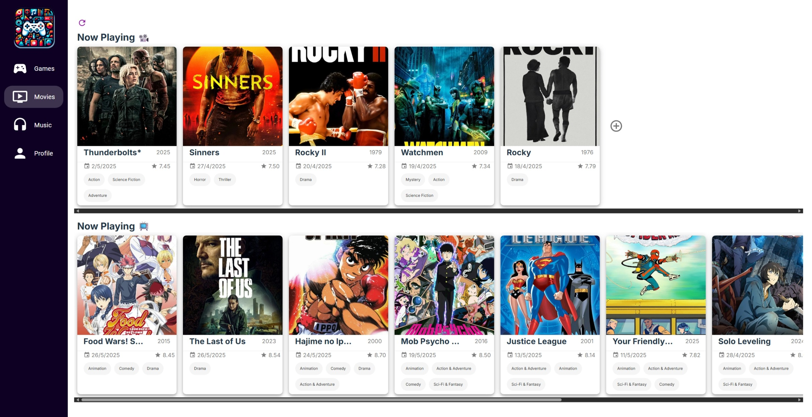
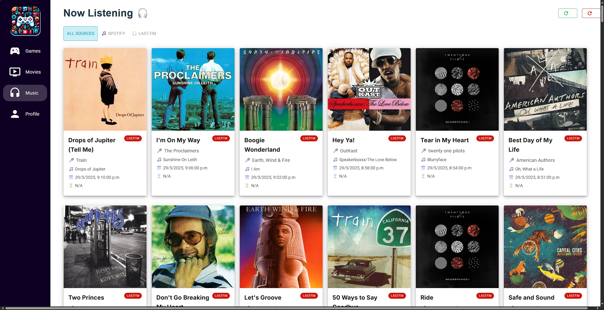
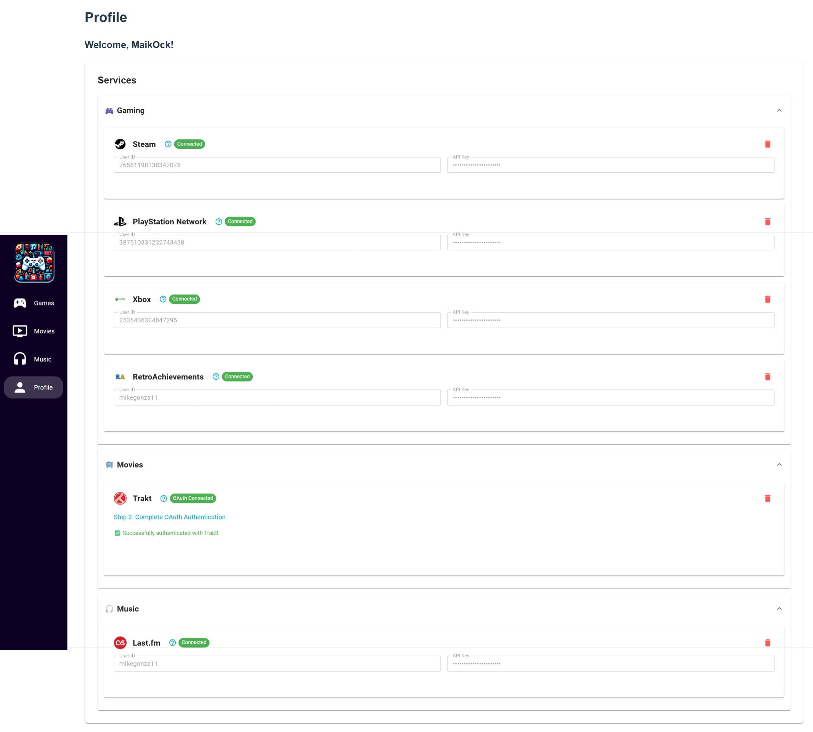
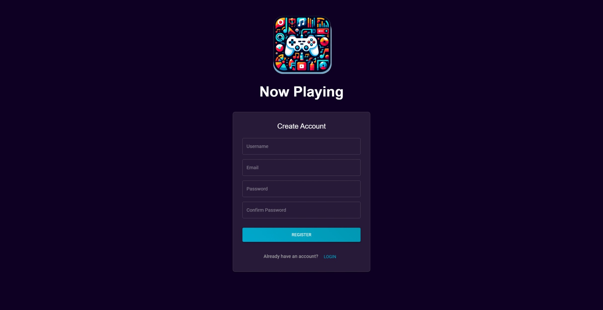

# NowPlaying

## What is it about?

NowPlaying is a comprehensive portfolio project designed to showcase your latest entertainment activities across multiple platforms. The application features JWT-based authentication and provides a centralized dashboard to track:

- **Gaming Activity**: Latest games you've played, time spent, achievements earned, and trophies collected across multiple platforms
- **Movie & TV Shows**: Movies and shows you've watched with detailed progress tracking
- **Music**: Songs you've listened to with scrobbling data and listening history

The application includes user authentication, profile management, integrated API key configuration for seamless service connectivity, and **advanced search functionality** across all entertainment categories.

## Recent Updates & Fixes

### Analytics System Optimization (Latest)

- **Performance Enhancement**: Completely optimized the analytics system for better performance and maintainability
  - **Endpoint Consolidation**: Reduced from 8 separate analytics endpoints to 2 streamlined endpoints
  - **Database Cleanup**: Removed 5 unused models (PlatformStatistics, GenreStatistics, AchievementProgress, ListeningSession, WatchSession)
  - **Query Optimization**: Replaced inefficient loops with bulk database aggregation queries, reducing query count from 15-20 to 5-7 per request
  - **Caching Implementation**: Added Redis/Django cache support with 1-hour TTL for ~10x faster response times on cached requests
  - **Code Reduction**: Reduced analytics codebase by 50% while maintaining all functionality

- **Technical Improvements**:
  - **Database Migrations**: Successfully applied migration to remove unused models
  - **Efficient Aggregation**: Implemented Django's Count() and Sum() for bulk operations instead of individual queries
  - **Cache Strategy**: Smart cache keys based on user ID, date range, and current date for optimal cache hit rates
  - **Streamlined Architecture**: Simplified from complex multi-endpoint system to focused single-endpoint design

- **Frontend Optimization**:
  - **CSS Bundle Size**: Reduced by 27KB+ by removing 7 unused CSS files
  - **Component Structure**: Verified all React components use Material-UI styling efficiently
  - **Performance**: Maintained all existing functionality while dramatically improving load times

### Advanced Search Functionality

- **Cross-Platform Game Search**: Real-time search across Steam, PlayStation, Xbox, and RetroAchievements platforms
  - **Autocomplete Suggestions**: Shows game title, platform, and cover image
  - **Debounced Search**: Optimized API calls with intelligent input handling
  - **Seamless Navigation**: Direct navigation to game details page on selection
  - **Platform Recognition**: Visual platform indicators in search results

- **Movie & Show Search**: Comprehensive search across Trakt movies and TV shows
  - **TMDB Integration**: Automatic poster image fetching for search results
  - **Dual Platform Search**: Searches both movies and shows simultaneously
  - **Rich Metadata**: Displays title, year, and poster in search suggestions
  - **Smart Navigation**: Routes to appropriate details page based on media type

- **Enhanced User Experience**:
  - **Loading States**: Visual feedback during search operations
  - **Error Handling**: Graceful handling of API failures and network issues
  - **Responsive Design**: Mobile-friendly search interface
  - **Keyboard Navigation**: Full keyboard support for accessibility

### Xbox Achievement Tracking Fix

- **Issue**: Xbox games were not appearing in the "Most Achieved 🏆" section despite having high achievement percentages
- **Root Cause**: TypeScript type guard logic incorrectly identified Xbox games as PSN games, causing wrong calculation methods
- **Solution**:
  - Fixed `isPsnGame()` type guard to specifically check for trophy object structure
  - Enhanced `isXboxGame()` type guard with proper platform string validation
  - Updated `calculateAchievementPercentage()` function to handle all game types (Steam, PSN, Xbox, RetroAchievements)
  - Fixed import conflicts between `utils.ts` and `typeGuards.ts`
- **Result**: Xbox games now properly appear in Most Achieved section with correct percentage calculations

### Enhanced Multi-Platform Gaming Support

- **Full Xbox Integration**: Achievement tracking across Xbox One, Series X/S, 360, and PC platforms
- **Unified Achievement Calculation**: Consistent percentage calculations across all gaming platforms
- **Platform-Specific Type Guards**: Robust TypeScript discrimination for different game data structures
- **Improved Error Handling**: Better debugging and error detection for gaming data processing

## Supported Apps

### Games

- **Steam**: ✅ Supported - Full integration with game library, achievements, and playtime tracking
- **PlayStation**: ✅ Supported - Complete trophy system with platinum, gold, silver, and bronze tracking
  - ⚠️ Manual cookie manipulation required for the npsso token
- **Xbox**: ✅ Supported - Achievement tracking across Xbox One, Series X/S, 360, and PC platforms
  - ⚠️ Account required from [OpenXBL](https://xbl.io/)
- **Nintendo**: ❌ Not supported
- **RetroAchievements**: ✅ Supported - Comprehensive support for classic consoles including PS1, PS2, Nintendo DS, Game Boy Color/Advance, and more

### Movies & TV Shows

- **Trakt**: ✅ Supported - Complete integration for both movies and TV shows with detailed watch history
  - ⚠️ No direct streaming platform integrations are available

### Music

- **Spotify**: ✅ Supported - Recently played tracks with enhanced metadata
- **Last.fm**: ✅ Supported - Music scrobbling with MusicBrainz integration, loved tracks, and listening history
- **Apple Music**: ❌ Not supported
- **YouTube Music**: ❌ Not supported

## Key Features

### Authentication & Security

- **JWT-based Authentication**: Secure login/registration system with automatic token refresh
- **Protected Routes**: All application features require authentication
- **User Profile Management**: Comprehensive account settings and service configuration

### Advanced Search System

- **Cross-Platform Game Search**: Real-time search across all gaming platforms with autocomplete
- **Movie & Show Search**: Unified search for movies and TV shows with TMDB poster integration
- **Smart Navigation**: Direct routing to appropriate detail pages with full data context
- **Debounced API Calls**: Optimized performance with intelligent request throttling
- **Platform Recognition**: Visual indicators for different platforms and media types

### Gaming Dashboard

- **Multi-Platform Support**: Unified view across Steam, PlayStation, Xbox, and RetroAchievements
- **Platform-Specific Features**:
  - PlayStation trophy system with visual trophy indicators
  - Steam achievement tracking with detailed statistics
  - Xbox achievement support across all Xbox platforms
  - RetroAchievements for classic console gaming
- **Smart Organization**: Games sorted by recent activity, total playtime, and achievement completion
- **Visual Platform Recognition**: Automatic platform detection with appropriate icons and branding

### API Key Management

- **Integrated Service Configuration**: Manage all API keys from within the application
- **Visual Service Status**: Clear indicators for connected vs. disconnected services
- **Secure Storage**: Server-side API key management with masked display
- **Platform-Specific Setup**: Guided configuration for each supported service

## Screenshots

### Main Dashboard

*Main dashboard showing unified entertainment tracking across all platforms*

### Gaming Dashboard

*Multi-platform gaming dashboard with achievement tracking and "Most Achieved 🏆" section*

### Game Details

*Detailed view of individual games with platform-specific achievement/trophy data*

### Movies & TV Shows

*Trakt integration showing watched movies and TV shows with progress tracking*

### Music Dashboard

*Music tracking with Spotify and Last.fm integration showing recent plays and scrobbling data*

### Profile & API Configuration

*API key management and service configuration with connection status indicators*

### Authentication

*JWT-based login and registration interface*

## Project Structure

- **API**: Django-based backend with JWT authentication, user management, and multi-platform API integrations
- **UI**: React-based frontend built with TypeScript, Vite, and Material-UI featuring modern authentication and responsive design

## Setup and Configuration

### API Configuration

To set up the required API integrations for this project, refer to the [API Configuration Guide](./API/README.md).

### UI Configuration

To set up the UI for this project, refer to the [UI Configuration Guide](./UI/README.md).

## Authentication Flow

1. **Registration/Login**: Users create accounts or log in through the unified authentication page
2. **Profile Setup**: Configure API keys for desired services through the integrated profile management
3. **Dashboard Access**: Access comprehensive dashboards for gaming, movies, and music
4. **Data Synchronization**: Automatic data fetching and updates from configured services

## Technology Stack

### Backend (API)

- **Django**: Web framework with REST API capabilities
- **Django REST Framework**: API development with JWT authentication
- **Multi-Platform Integrations**: Steam, PlayStation, Xbox, Trakt, Spotify, Last.fm APIs

### Frontend (UI)

- **React 18**: Modern UI components and state management
- **TypeScript**: Type safety and enhanced developer experience
- **Material-UI**: Responsive design system
- **JWT Authentication**: Secure token-based authentication
- **React Router**: Protected routing system

## Changelog

### Version 1.2.0 - Advanced Search Functionality

#### 🔍 Cross-Platform Search System

- **Game Search**: Real-time search across Steam, PlayStation, Xbox, and RetroAchievements
  - Autocomplete with game title, platform, and cover image
  - Debounced API calls for optimal performance
  - Direct navigation to game details page
  - Visual platform indicators in search results

- **Movie & Show Search**: Unified search for Trakt movies and TV shows
  - TMDB poster integration for rich visual results
  - Simultaneous search across both media types
  - Smart navigation to appropriate details page
  - Complete data fetching on selection

#### 🎯 Enhanced User Experience

- **Loading States**: Visual feedback during search operations
- **Error Handling**: Graceful handling of API failures and network issues
- **Responsive Design**: Mobile-friendly search interface
- **Keyboard Navigation**: Full accessibility support
- **Debounced Input**: Optimized performance with intelligent request throttling

#### 🔧 Technical Improvements

- **New Components**: `GameSearch` and `MovieShowSearch` components with autocomplete
- **Backend Endpoints**: New search endpoints for games and media
- **API Integration**: Enhanced backend search functionality across all platforms
- **Data Handling**: Improved data structure management for cross-platform compatibility
- **Navigation**: Enhanced routing with proper state management

### Version 1.1.0 - Gaming Platform Fixes & Enhancements

#### 🎮 Xbox Games Most Achieved Fix (Critical)

- **Fixed**: Xbox games now properly appear in "Most Achieved 🏆" section
- **Resolved**: Type guard logic that incorrectly identified Xbox games as PSN games
- **Enhanced**: `calculateAchievementPercentage()` function to handle all platform types
- **Improved**: Platform detection with robust TypeScript type guards

#### 🔧 Technical Improvements

- **Modularized**: Type guard functions separated into dedicated `typeGuards.ts`
- **Fixed**: Import conflicts between utility modules in `gameCard.tsx` and other components
- **Enhanced**: Error handling and debugging capabilities for gaming data
- **Added**: Comprehensive logging for troubleshooting achievement calculations

#### 🎯 Achievement Calculation Overhaul

- **Steam**: Simple percentage based on unlocked/total achievements
- **PlayStation**: Weighted trophy scoring system (Platinum: 300pts, Gold: 90pts, Silver: 30pts, Bronze: 15pts)
- **Xbox**: Direct percentage calculation with proper type detection
- **RetroAchievements**: Standard percentage calculation

#### 🛠️ Developer Experience

- **Improved**: TypeScript type safety across gaming utilities
- **Added**: Debug logging for game processing pipeline (now removed in production)
- **Enhanced**: Code organization and separation of concerns
- **Fixed**: Hot module reload issues with TypeScript changes
- **Cleaned**: Removed duplicate functions and debug logs from production code

### Version 1.0.0 - Initial Release

- **Multi-Platform Gaming**: Steam, PlayStation, Xbox, RetroAchievements support
- **Entertainment Tracking**: Trakt integration for movies and TV shows
- **Music Integration**: Spotify and Last.fm scrobbling
- **JWT Authentication**: Secure user authentication and API key management
- **Responsive UI**: Modern React-based frontend with Material-UI

## Deployment

The project includes Docker configuration for easy deployment using Docker Compose with both development and production configurations.
